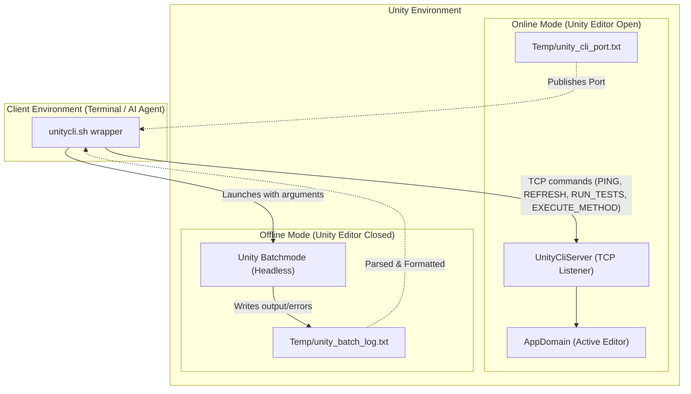

# UnityCliRunner

A lightweight, high-performance tool that bridges external command line interfaces (and AI coding agents) with the Unity Editor. It enables sub-second compilation loops, clean test execution, and static method invocations in both **Online Mode** (communicating with an open editor via loopback TCP sockets) and **Offline Mode** (falling back to headless batchmode).

---

## Architecture Overview

UnityCliRunner operates in two distinct modes depending on whether the Unity Editor is active for the project:



### Execution Mode Comparison

| Feature | Online Mode (Unity Editor Open) | Offline Mode (Unity Editor Closed) |
| :--- | :--- | :--- |
| **Communication Channel** | TCP Sockets (loopback) | Command-line arguments & logs |
| **Feedback Loop Speed** | ⚡ **Sub-second** (re-uses open AppDomain) | ⏳ **15–30+ seconds** (launches new process) |
| **Compilation Trigger** | Live `AssetDatabase.Refresh()` | Headless import & compile phase |
| **Test Execution** | Instantly runs in active Editor | Runs via batchmode `-runTests` |
| **Method Execution** | Calls method on active thread | Runs via batchmode `-executeMethod` |
| **Output Diagnostics** | Real-time console extraction | Parses batch log for C# errors/warnings |

---

## Key Features

- ⚡ **Sub-Second Compilation Loop**: Modify C# files and run tests or custom editor methods instantly via TCP sockets without restarting or reloading the editor graphical interface.
- 🤖 **Perfect for AI Agent Workflows**: Includes a pre-configured Agent Skill allowing AI agents to command and inspect Unity without GUI dependencies or slow batchmode startups.
- 🎨 **Beautiful Compiler Output**: Reformats Unity logs and prints compiler warnings and errors in a clean, `dotnet build` format with ANSI colors (warnings in yellow, errors in red).
- 🧪 **Flexible Test Runner**: Run EditMode or PlayMode tests (or both), filter specific tests by name (substring/regex), or target a specific test category. Failed tests are printed in a clean `dotnet test` format.
- ⚙️ **Parameter-Aware Method Execution**: Execute arbitrary static methods in both online and offline modes, supporting automatic primitive type parsing and JSON deserialization.
- 🔌 **Conflict-Free Ports**: Avoids port conflicts by dynamically binding to a free loopback port on startup and writing it to `Temp/unity_cli_port.txt`.
- 🪟 **PowerShell Socket Bridge**: Uses PowerShell socket communication internally on Windows to avoid the subshell socket inheritance issues common in Git Bash.
- 📦 **UPM Package Support**: Clean package-based setup that doesn't clutter your project's main codebase.

---

## Installation & Setup

### 1. Install the Unity Package

Choose one of the standard Unity Package Manager (UPM) options:

#### Option A: Install via Git URL (Recommended)
1. Open your Unity project's `Packages/manifest.json`.
2. Add the following entry to the `dependencies` block:
   ```json
   "com.pereviader.unityclirunner": "https://github.com/PereViader/UnityCliRunner.git?path=Packages/com.pereviader.unityclirunner"
   ```
3. Alternatively, in the Unity Editor, go to **Window > Package Manager**, click the **+** button in the top-left corner, select **Add package from git URL...**, and paste:
   `https://github.com/PereViader/UnityCliRunner.git?path=Packages/com.pereviader.unityclirunner`

#### Option B: Manual Installation
Copy the `Packages/com.pereviader.unityclirunner` folder from this repository into your Unity project's `Assets` directory (e.g., `Assets/UnityCliRunner`).

> [!IMPORTANT]
> Because it contains editor-only scripts, ensure the folder structure containing `UnityCliServer.cs` and `UnityCliCompilationTracker.cs` is kept under an `Editor` folder (or referenced by an Editor-only assembly definition).

### 2. Add the Runner Script
Copy [unitycli.sh](file:///c:/Users/perev/Code/UnityCliRunner/unitycli.sh) from the root of this repository to the root directory of your Unity project.

### 3. Requirements
- A shell environment capable of running Bash (e.g., Git Bash on Windows, macOS/Linux terminal).
- PowerShell (on Windows, used internally to establish TCP socket connections).
- Unity version 2021.3 or higher.

---

## AI Agent Integration & Agent Skills

If you use agentic AI tools (like **Antigravity**, **Gemini**, **Cline**, or **Roo Code**) to develop inside this repository, UnityCliRunner includes a pre-packaged **Agent Skill** under the [.agents/skills/unity-cli](file:///c:/Users/perev/Code/UnityCliRunner/.agents/skills/unity-cli) directory.

### Why use the Agent Skill?
- **Sub-Second Feedback**: Agents can instantly compile code and run tests to verify changes, saving massive amounts of waiting time and token usage.
- **Warm Unity Instance**: Agents are trained to run `start batchmode` once at the beginning of their task. This keeps a headless Unity process open in the background, allowing all subsequent checks to run via TCP sockets in < 1 second instead of restarting Unity every time (~30s delay).
- **Diagnostics Formatting**: Compilation errors and test failures are formatted in standard compiler diagnostics patterns, which agents can easily read and fix autonomously.

### How to Install for Agents
Simply place the `.agents/` folder at the root of your project. Agent frameworks that support automatic skill discovery (like those scanning `.agents/` or using custom skill directories) will automatically index the `unity-cli` skill.

---

## How to Use It

Run [unitycli.sh](file:///c:/Users/perev/Code/UnityCliRunner/unitycli.sh) from the root directory of your Unity project:

### Background Instance Management
Keep a background Unity instance warm to execute tests and methods in sub-second Online Mode without launching the Unity GUI:

```bash
# Start a background Unity instance in headless batchmode
./unitycli.sh start batchmode

# Start a background Unity instance in interactive mode (opens Unity Editor GUI)
./unitycli.sh start interactive

# Check if the background Unity instance is running and reachable
./unitycli.sh status

# Block and wait until the background Unity instance is fully loaded and ready
./unitycli.sh wait-ready

# Safely stop the background Unity instance (falls back to process kill if needed)
./unitycli.sh stop
```

### Core Operations
If Unity is not running, these commands will automatically fall back to launching batchmode Unity (Offline Mode):

```bash
# Trigger AssetDatabase.Refresh() and print compilation diagnostics
./unitycli.sh refresh

# Run both EditMode and PlayMode tests
./unitycli.sh test

# Run only EditMode tests
./unitycli.sh test --editmode

# Run only PlayMode tests
./unitycli.sh test --playmode

# Run tests matching a specific name filter (regex or substring)
./unitycli.sh test --filter "MyNamespace.MyTestClass"

# Run tests matching a specific category filter
./unitycli.sh test --category "Smoke"
```

### Exit Codes
- `0`: Success (all tests passed, compilation succeeded, method executed successfully, or connection succeeded).
- `1`: Failure (compilation errors, failed tests, method execution exception, or connection check failed).

---

## Method Execution with Parameters

The `executemethod` subcommand executes static methods in the Unity editor AppDomain directly from the shell:

```bash
./unitycli.sh executemethod Namespace.Class.Method 4 3.5 "hello" "{\"Value\":42}"
```

### Supported Parameter Types
- **Primitives**: `int`, `float`, `double`, `bool`, `long`, `decimal` (parsed using invariant culture).
- **Strings**: Standard C# strings.
- **Complex Types (JSON)**: Any other C# class/struct type will be automatically deserialized from its raw string parameter using Unity's `JsonUtility.FromJson`.

### Overload Resolution
Overloaded static methods are resolved automatically by matching the number of arguments provided.

### Return Value Serialization
- **Primitives & Strings**: Printed directly to the console.
- **Complex Types**: Automatically serialized and printed as a JSON payload using `JsonUtility.ToJson`.
- **Void/Null**: Prints `Unity Response: SUCCESS` (in batchmode) or no extra payload.

---

## Integration Tests

The repository includes a robust automated integration test suite [unitycli_integration_tests.sh](file:///c:/Users/perev/Code/UnityCliRunner/unitycli_integration_tests.sh) to verify the CLI runner's correctness in both online and offline environments.

### Running the tests
Simply execute:
```bash
./unitycli_integration_tests.sh
```

### Test Suite Execution Flow:
1. Detects if Unity is running for the project. If not, it launches Unity in the background and waits for the TCP server to start.
2. Runs a suite of test scenarios (such as compiling errors/warnings, skipped tests, executing successful/failing/missing methods) in **Online Mode** via TCP sockets.
3. Compares the normalized console output against verified outputs located under `IntegrationTests/<TestCase>/output.online.verified.txt`.
4. Gracefully terminates the running Unity Editor process.
5. Re-runs the entire suite of scenarios in **Offline Mode** (batchmode).
6. Compares batchmode console output against verified outputs under `IntegrationTests/<TestCase>/output.offline.verified.txt`.
7. Restores any modified test files to their original state upon completion.

### Bootstrapping Verified Outputs
If you modify the output format of `unitycli.sh` and need to update the expected baselines, run the integration tests with the `BOOTSTRAP=true` environment variable:
```bash
BOOTSTRAP=true ./unitycli_integration_tests.sh
```
This automatically overwrites all `output.online.verified.txt` and `output.offline.verified.txt` files with the actual output generated during the test run.
